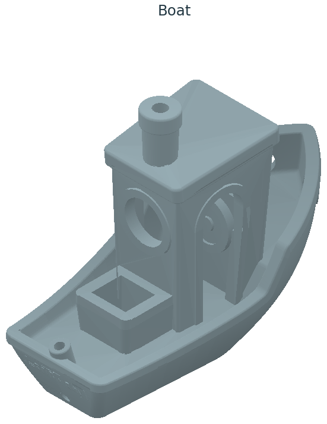
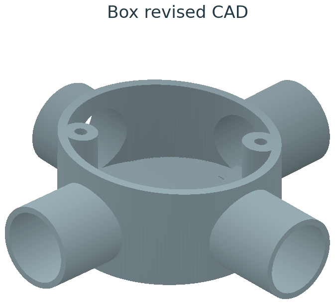
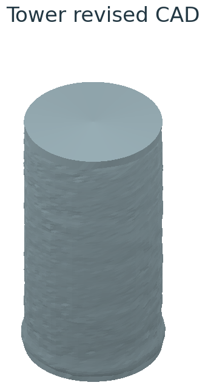

# Hack3D 2026: 3D Part Reconstruction

**Prepared:** October 4, 2026

**Challenge:** Red Team Vs Blue Team – .PLY Me a Secret

**Team:** GatorHack

**Team Members:** Dumindu Bandara, Dakshina Tharindu, Sahan Sanjaya, Hari Parvatham

**Source Code:** https://github.com/UFESL/gatorhack_csaw_2026_qualifier_submission

## Overview

This repository contains our reconstruction submission for the three scanned parts (Boat, Box, Tower): the final CAD models, the dimensional measurements and evidence behind them, and the scripts needed to rebuild the package from scratch.

**Table 1:** Reconstructed models, scan-to-model RMS distances, and nominal material compositions.

| | Boat | Box | Tower |
|---|---|---|---|
| **Reconstructed Model** |  |  |  |
| **RMS Distance** | 0.108 mm | 0.354 mm | 0.043 mm |
| **Material Composition** | PLA | Nominal 70 wt.% HDPE + 30 wt.% fly-ash cenospheres | Nominal 60 vol.% acrylate photopolymer resin + 40 vol.% hollow glass microspheres |

## Report Documents

| Document | Contents |
|---|---|
| `Final_Report.pdf` | Numbered process, evidence, results, and limitations |
| `Restored_Parts_Drawings.pdf` | Four drawing sheets |
| `Dimension_Analysis.pdf` | Source profiles, feature definitions, comparison models, and final revised-model results |
| `Revised_Model_Results.pdf` | Five new figures, final model definitions, and same-sample fit comparisons |
| `Materials_Composition.json` | Material compositions and their supporting evidence |

## Repository Layout

| Path | Contents |
|---|---|
| `CAD/` | Final model files, see below |
| `Measurements/` | Complete dimension data (JSON/CSV), including qualified missing values and coordinate transforms |
| `Evidence/` | Numerical audits and validation results |
| `Reproducibility/` | Scripts and instructions to rebuild the package |

### CAD Models

| Model | Files | Description |
|---|---|---|
| Boat | `Boat_reconstructed.*` (STL, PLY, OpenSCAD) | Final model |
| Tower | `Tower_revised.*` (STL, PLY, OpenSCAD) | Final model, new loft defined by `CAD/revised_parameters.json` and `Measurements/Tower_revised_sections.csv` |
| Box | `Box_revised.*` (STL, PLY, OpenSCAD) | Final model, new surfaces defined by `CAD/revised_parameters.json` |
## Notes and Assumptions

- All model coordinates are interpreted as millimetres under the shared-scan-unit assumption supported by Boat. STL has no embedded unit field: select mm on import.
- Boat's dimensions are from the official reference. Tower and Box dimensions are estimated from the scans.
- Box's nominal material is inferred as 30 wt.% fly-ash cenospheres / 70 wt.% HDPE from its 30% surface label and the paper's HDPE30 definition. Its blind-hole depth remains unresolved.
- Box's final floor follows the measured slope with an assumed 1 mm minimum in missing geometry. Inside the body, socket bores are constrained to preserve this floor; hidden transitions remain assumptions.
- Both revised STL exports were checked directly. OpenSCAD source files were generated, but a compiler/render was not available.
